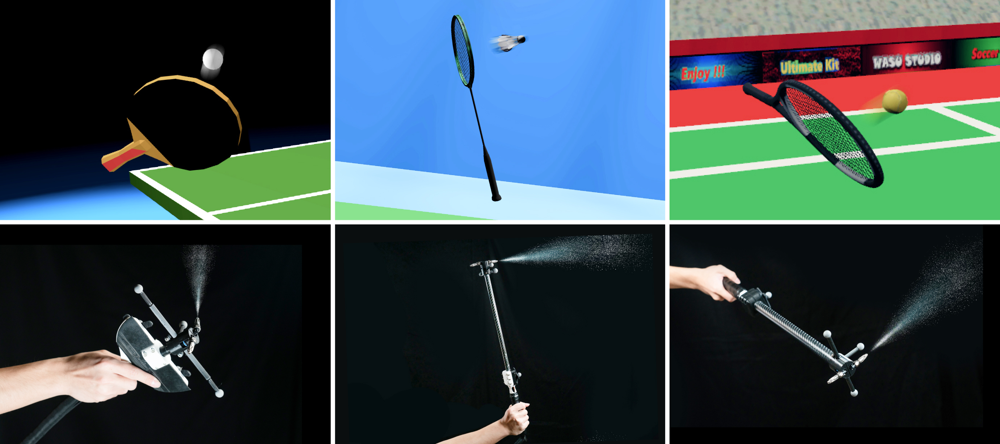
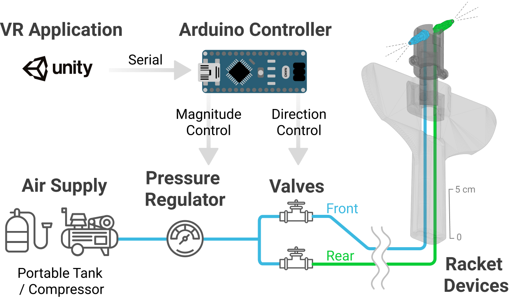
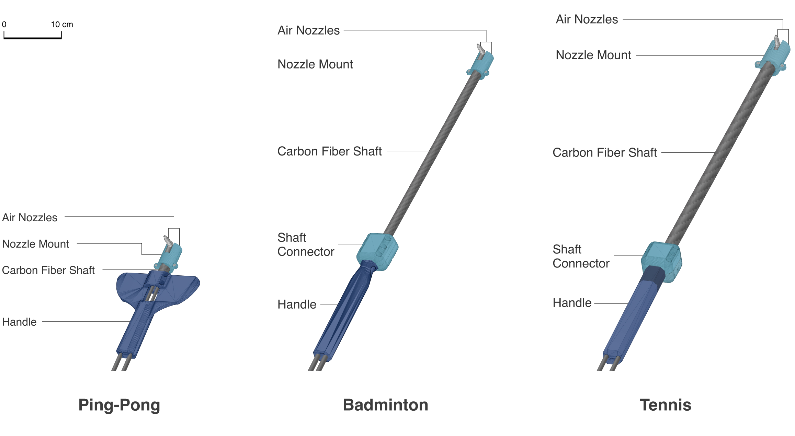
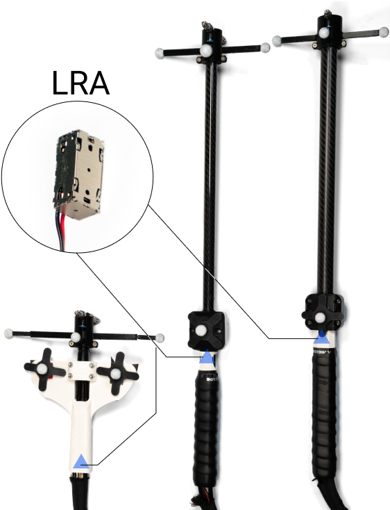
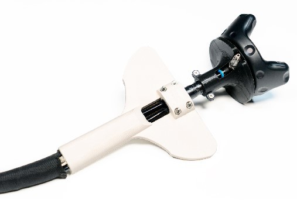
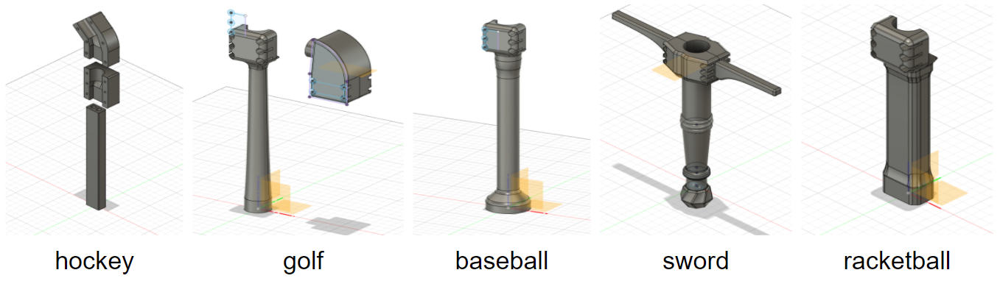
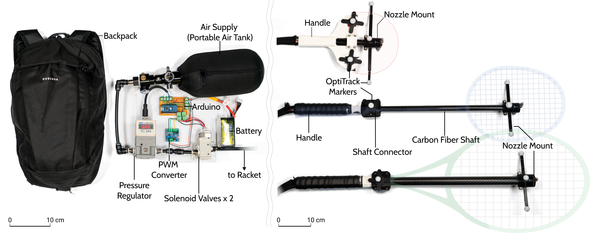

# AirRacket

>This is the opensource folder for CHI'22 paper "AirRacket: Perceptual Design of Ungrounded, Directional Force Feedback to Improve Virtual Racket Sports Experiences"

### Table of Contents  
- [System Diagram](#system-diagram)
  - [Racket-shaped Handheld Devices](#racket-shaped-handheld-devices)
  - [Alternative Tracking System](#alternative-tracking-system)
  - [Additional Racket Sports](#additional-racket-sports)
- [Pneumatic Control System](#pneumatic-control-system)
  - [Pneumatic System Overview](#pneumatic-system-overview)
  - [Circuit Schematic](#circuit-schematic)
  - [Control Code](#code)
    - [Arduino](#arduino)
    - [Unity](#unity) 
- [Website, Paper/Video Links and BibTeX](#reference)

<a name="system-diagram"/>

## System Diagram

<a name="racket-shaped-handheld-devices"/>

## Racket-shaped Handheld Devices

<a name="alternative-tracking-system"/>

### Alternative Tracking System

|                    OptiTrack                     |                         ViveTracker                          |
| :----------------------------------------------: | :----------------------------------------------------------: |
|  |  |

<a name="additional-racket-sports"/>

### Additional Racket Sports

<a name="pneumatic-control-system"/>

## Pneumatic Control System

<a name="pneumatic-system-overview"/>

### Pneumatic System Overview

<a name="circuit-schematic"/>

### Circuit Schematic

<a name="code"/>

### Control Code

<a name="arduino"/>

#### Arduino

<a name="unity"/>

#### Unity

<a name="reference"/>

## Website, Paper/Video Links and BibTeX
